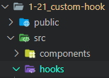
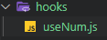

# 챕터 1-21 : 커스텀 Hooks 만들기

> 참고 : https://react.vlpt.us/basic/21-custom-hook.html

#### 📕 주로 배운 내용

- 커스텀 Hooks 기본 개념
  - 반복되는 로직을 Hook으로 만들어 손쉽게 재사용하도록 만들 수 있다.
  - 간단히 원하는 기능을 Hooks 등을 통해 구현하고, 사용하길 원하는 값을 **배열에 집어넣어 반환**하면 된다.

<br>

- 사용하기

  - `src` 디렉터리 내부에 `hooks`라는 이름의 디렉터리를 새로 만든다.<br>
    (이는 의무 사항이 아니지만, 컴포넌트 종류 구분을 위해 만들어주었다.)<br>
    

  - `hooks` 내부에 js파일을 만들어 함수를 작성한다. 보통 여느 Hooks처럼 `use`로 시작한다.<br>
    

  - 기호에 따라 Hooks 등을 사용하여 함수를 작성하고, export하여 외부에서 사용할 수 있도록 한다.<br>

    ```
    import { useState, useRef } from "react"

    function useItem(initialNum) {
      const [num, setNum] = useState(initialNum);

      const nextnum = useRef(initialNum + 1);

      const increase = () => {
        setNum(num.concat(nextnum.current));
        nextnum.current += 1;
      };

      const init = () => {
        setNum(initialState);
      };

      return [num, increase, init];
    }

    export default useItem;
    ```

  - 외부에서 커스텀 Hook을 불러오기

    ```
    import useNum from "./hooks/useNum";
    ```

  - 외부 컴포넌트 파일에서 커스텀 Hook을 사용하기

    ```
    const [num, increase, init] = useNum(0);
    ...
    return(
      <div>
        <div>{num}</div>
        <button onClick={increase}>+1</button>
        <button onClick={init}>초기화</button>
      </div>
    )
    ```
