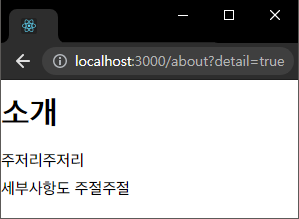
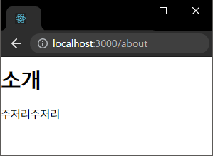

# 챕터 5-02 : 파라미터와 쿼리

> 참고 : https://react.vlpt.us/react-router/02-params-and-query.html

#### 📕 주로 배운 내용

- 파라미터 & 쿼리

  - 페이지 주소에 전달하는 유동적인 값으로, 받은 값에 따라 페이지의 구성 요소를 유동적으로 조작할 수 있다.

<br>

- **파라미터**

  - 보통 특정 id, 이름 등의 데이터 조회 시에 사용된다.
  - Route 태그 경로 뒷부분에 `/:파라미터명`을 써주면, 해당 컴포넌트의 `match.params.파라미터명`으로 주소창에 넣은 파라미터 값을 조회할 수 있다.<br>

    ```
    <Route path="/profile/:username" component={Profile} />
    ```

    ```
    const userList = {
      uncyclocity: {
        name: "백괴",
        address: "성남시"
      },
      joohomin: {
        name: "주펄",
        address: "용인시"
      }
    };

    function Profile({ match }){
      const userName = match.params.userName;
      const userInfo = userList[userName];

      if(!userInfo) return <div>정보가 존재하지 않습니다.</div>;

      return (
        <div>
          <h2>{userInfo.name}</h2>
          <p>거주지 : {userInfo.address}</p>
        </div>
      );
    }

    export default Profile;
    ```

    <center>

    ⬇

    

    </center>

- **쿼리**

  - 보통 옵션 값이나 세팅 값 등에 사용된다.
  - URL 끝부분에 `?파라미터명=파라미터값`을 붙여주어 사용하며, 해당 컴포넌트의 `location.search`에 문자열 형식으로 저장된다.
    👉 이는 서드파티 라이브러리인 「qs」로 파싱하여 객체 형태로 변환할 수 있다.

  ```
  import qs from "qs";

  function About({ location }) {
    // 「location.search」를 객체로 변환한 값을 할당
    const query = qs.parse(location.search, {
      ignoreQueryPrefix: true
    });

    // 쿼리의 값은 항상 문자열이다.
    const isViewDetail = query.detail === "true";

    return (
      <div>
        <h2>소개</h2>
        <p>소개입니다.</p>
        {isViewDetail && <p>세부사항입니다.</p>}
      </div>
    );
  }

  export default About;
  ```

  <center>⬇</center>

  <span>

  <center>

   

  </center>

  </span>
