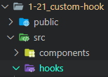
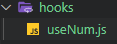

# 16. 커스텀 Hook 만들기

> _References_ <br> https://react.vlpt.us/basic/21-custom-hook.html

## 📕 주로 배운 내용

- ### 커스텀 Hooks
  - **반복되는 로직**을 Hook으로 만들어, **함수형 컴포넌트에서 손쉽게 재사용**하도록 만들 수 있다.
  - 원하는 로직을 다양한 Hooks를 통해 구현하고, 원하는 값을 반환하도록 짜면 된다. <br> 👉 사실 이름만 커스텀 Hooks일 뿐이며, 단순히 함수형 컴포넌트에서 사용할 수 있는 **값을 반환하는 커스텀 함수**를 만들면 된다.

<br>

- ### 커스텀 Hook 생성하기

  - `src` 디렉터리 내부에 **`hooks` 디렉터리**를 새로 만든다. <br> (필수가 아니며, 보통 편의 상 생성해주는 편이다.)<br>
    

  - `hooks` 내부에 hook이 될 파일을 생성한다. Hook임을 확실히 하기 위해 **파일명 앞에 `use`** 를 붙이는 것을 추천한다. <br>
    

  - 기호에 따라 함수 로직을 작성한다. <br> 외부에서 사용할 수 있도록 **export**는 필수이다.

    **`useMath.js`**

    ```javascript
    import { useStatef } from "react";

    // 외부에서 사용할 수 있도록 export 해줌
    export default function useMath(initialNum) {
      const [num, setNum] = useState(initialNum);

      const increase = () => {
        setNum(num + 1);
      };

      const decrease = () => {
        setNum(num - 1);
      };

      const init = () => {
        setNum(initialNum);
      };

      return [num, increase, decrease, init];
    }
    ```

  - 외부에서 커스텀 Hook을 불러오기

    ```javascript
    import useMath from "./hooks/useMath";
    ```

  - 외부 컴포넌트 파일에서 커스텀 Hook을 사용하기

    ```javascript
    const [num, increase, decrease, init] = useMath(0);
    ...
    return(
      <div>
        <div>{num}</div>
        <button onClick={increase}>+1</button>
        <button onClick={decrease}>-1</button>
        <button onClick={init}>초기화</button>
      </div>
    );
    ```
